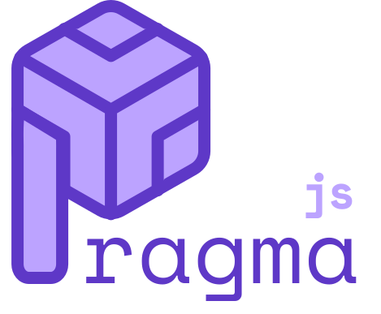

[](https://snyk.io/test/npm/pragmajs/0.3.0)

[](https://robo-monk.github.io/pragmajs)

<br>

## Dead simple, fast UI-composer in JavaScript

[Check out a currently under construction Demo](https://robo-monk.github.io/pragmajs)

<br>

# Installation

### npm
```bash
npm i pragmajs
```

### Yarn

```bash
yarn add pragmajs
```

# How To

## Quick HTML Element manipulation

If you want to create an element from an HTMLElement that already exists in the DOM:

```html
<div id='jeff'></div>
```
```js	
import { _e } from 'pragmajs'
let element = _e("#jeff") // select the element like you would in CSS
```

If you want to create a new element programatically and append it to the DOM yourself, you can do:
	
```js
let element = _e("div#jeff.center-div-2.woo", "text").appendTo('body')
```
will result in this:

```html
<body>
  <div id='jeff' class='center-div-2 woo'>text</div>
</body>
```

### _e API (v1)

```js

  let element = _e("#jeff")
  let selector = "#jeff"

  _e("div#vid")
    .appendTo(element || selector)
    .prependTo(element || selector)
    .destroy() // remove the element from the dom. fucken obliterate it

    .append(element) // append an element inside.

    .css(`
      position absolute
      background red
      text-align center
    `) // you can write normal css styles, but you could
    // make your life easier by writing in the simplified
    // syntax which replaces new lines with `;` and you 
    // dont need to type `:` after every css attr. your choice

    .html(`innerHTML`) // change inner html
    
    .setId(`id`)
    .addClass('class1', 'class2', 'class3', ...)
    
    .listenTo({ 'click': () => {}, 'hover': () => {} ... })
    
    .attr(attrName, value) // edit html attribute like src or href
    
    .find(selector) // find an element inside
    .findAll(selector) // find all elements inside

    .rect() // get BoundingRect of element
    .offset() // get offset of element

  // self explanatory GETTERS
  element.top
  element.left
  element.width
  element.height
  element.text

```

## Pragmas
A `Pragma` is an object that provides an interface for creating complex interactions with minimal code. A `Pragma` can be associated with an `HTMLElement`, which can be extremely useful for translating these complex interactions to the front end.

### Creating a new Pragma
```js
  import { _e, _p } from 'pragmajs'

  let pragma1 = _p('name') // you can give the Pragma a 
         // name (which is going to be its key), or leave 
         // it blank to generate a random one through 
         // an overengineered random string generator

  let element = _e('#jeff') // an element that exists on the dom already
  let pragma2 = _p()
                  .as(element) // associate pragma2 with 
                  // element pragma2.element is going to be #jeff
  
  let pragma3 = _p()
                  .as(_e("div#gme.hold"))
                  .html("if he is still in, im still in")
                  .css(`
                    background red
                    font-size 420
                    font-family 'Comic Sans'
                  `)

  import { tpl } from 'pragmajs'
  let pragma4 = p().from(tpl.monitor) //create a Pragma 
                            // from a template (another Pragma)
	
```

## Pragma API:

### New:

```js
let p = _p()

p.createEvent("yoing")

p.on("yoing", function(...args) {
	// this keyword is bounded to be p
	console.log(...args)
})

p.triggerEvent("yoing", "yoingArgument1", "yoingArgument2") 
	// going to print "yoingARgument1", "yoingArgument2"

p.on("yoing", function(...args) {
	console.log('im also gonna get triggered from now on')
})

p.triggerEvent("yoing", "yoingArgument1", "yoingArgument2") 
	// going to print "yoingARgument1", "yoingArgument2"
	// 'im also gonna get triggered from now on'


```

```js

let p = p()
p.createEvent('yoing2')

p.onNext('yoing2', () => {
	console.log('im only going to get triggered on the next yoing event')
})

p.triggerEvent("yoing2") // prints: 'im only going to get triggered on the next yoing event'
p.triggerEvent("yoing2") // nothing happens
p.triggerEvent("yoing2") // nothing happens
```

```js

let p = p()

p
	.createWire('index')
	.setIndex(0) // sets index wire to 0

p.on('indexChange', (newValue, lastValue) => {
	// will get triggered when p.index changes value
	console.log(newValue, lastValue)
})

p.onNext('indexChange', () => { //... })

p.index = 1 // prints: 1, 0
p.index = 2 // prints: 2, 1
p.setIndex(3) // prints: 3, 2

p.setIndexSilently(10) // nothing gets triggered 

```


### Legacy:
```js

let p = _p()

p.element = "<HTMLElement>" || _e('#dash') // set the element associated with the pragma
console.log(p.element, p._e) // => <HTML Element id='dash'>

  // --- PRAGMA VALUE & ACTION CHAIN ---

p.do(function(plip, plop, plap){ 
  console.log(`Value changed to ${this.value}`, plip, plop, plap) 
})  // assign a callback function that will run 
    // every time a shift in the pragma's value occurs. 
    // All the callbacks that are being run when the value changes,
    // are part of the *ActionChain* of the Pragma.


// every time the value of the pragma is changed, its *ActionChain* runs
p.value = 420  // the value is going to change 
          //  and because of the above p.do(..) 
          // the console is going to print: => Value changed to 420  

console.log(p.value) // => 420 


p.exec(1,2,3) // run its *Action Chain* with 
              // whatever arguments you add
// => Value changed to 420, 1, 2, 3


let another_pragma = _p().do(function(){
  console.log('wooooo', this.value)
})

p.wireTo(another_pragma) // link the pragma value 
                        // to another_pragma's value. 
                        // Every time the pragma's value 
                        // changes, change the 
                        // another_pragma's value to the same one

p.value += 1
// => Value changed to 421
// => wooooo, 421


// --- UTILITIES ---

p.key = 'secks'
p.setKey('john lennon') // set `key` of the pragma

console.log(p.id) // => john-lennon
// return the HTML id of 
// the element associated 
// with the pragma


p
  .on('click').do(function() { console.log('ive been clicked')})
  .on('hover').do(function() { console.log('ive been hovered')})

  .addListeners({'click': function(){}, 'hover': function(){}})

  .run(function(){}, function(){} ....)
    // run the passed callback 
    // functions as the pragma itself. 
    // The `this` keyword inside the functions 
    // will reference the pragma

  .pragmatize() // append pragma's element to its parent
  .pragmatizeAt(element || selector)
      // append pragma's element at the 
      // element/selector you provide
  
  .contain(another_pragma) // add another_pragma 
  // as a `child` of `p` and append it 
  // inside p's associated HTML element

```
You can also call some of `_e`'s methods from the pragma directly, will modify its associated html element (if any) accordingly.

```js
pragma.html('wo')
      .css('color crystalblue')
      .addClass('lucy', 'in', 'the', 'sky', 'center-div-flexbox', 'zindexxxxx')
      .setId('paul')

console.log(p.offset, p.text, p.top, p.left, p.width, p.height)
```
